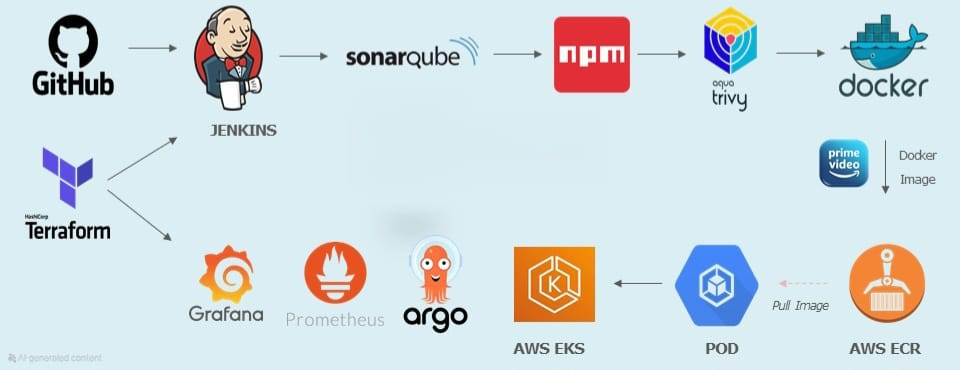

# Devops Project

## Project Overview
This project demonstrates deploying an Amazon Prime clone using a set of DevOps tools and practices. The primary tools include:

- **Terraform**: Infrastructure as Code (IaC) tool to create AWS infrastructure such as EC2 instances and EKS clusters.
- **GitHub**: Source code management.
- **Jenkins**: CI/CD automation tool.
- **SonarQube**: Code quality analysis and quality gate tool.
- **NPM**: Build tool for NodeJS.
- **Aqua Trivy**: Security vulnerability scanner.
- **Docker**: Containerization tool to create images.
- **AWS ECR**: Repository to store Docker images.
- **AWS EKS**: Container management platform.
- **ArgoCD**: Continuous deployment tool.
- **Prometheus & Grafana**: Monitoring and alerting tools.

